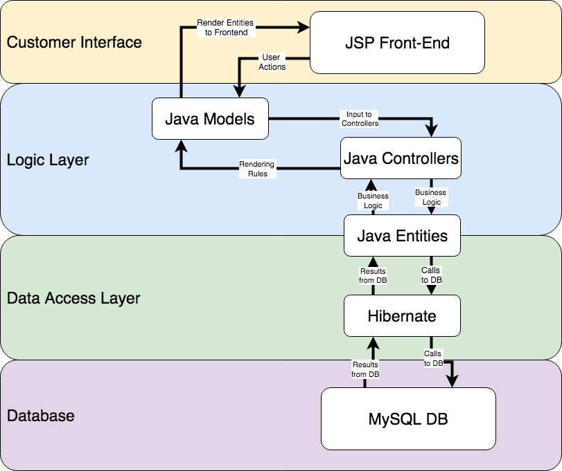

# Developer
This README includes details on the technology stack and instructions for getting started. There are three main folders in this repository:

1. [SpringMVCAnnotationOnlineStore](SpringMVCAnnotationOnlineStore): The web application
1. [database](database): database initial state specification
1. [pythonFunctions](pythonFunctions): SMPT email functionality

## Architecture Overview
1. [Java controllers](SpringMVCAnnotationOnlineStore/src/main/java/org/o7planning/springmvconlinestore/controller/)
1. [Java DAO](SpringMVCAnnotationOnlineStore/src/main/java/org/o7planning/springmvconlinestore/dao/)
1. [Java Entities](SpringMVCAnnotationOnlineStore/src/main/java/org/o7planning/springmvconlinestore/entity/)
1. [Java Model](SpringMVCAnnotationOnlineStore/src/main/java/org/o7planning/springmvconlinestore/model/)

### Overview Diagram


## Dependencies
This project has a number of software dependencies. The major technologies are covered below, with links to further resources.
1. [Java 1.8](https://www.oracle.com/technetwork/java/javase/downloads/jdk8-downloads-2133151.html)
1. [Python 3.6](https://www.python.org/downloads/release/python-360/) - Email receipt functionality
    - Also required: [MySQL-connector-python](https://dev.mysql.com/downloads/connector/python/): `python3 -m pip install MySQL-connector-python`
1. [Eclipse](https://www.eclipse.org) - Deployment IDE
1. [Tomcat7](https://tomcat.apache.org) - Java Servlet / JSP Deployment
1. [MySQL (8) Community Server](https://dev.mysql.com/downloads/mysql/) - database server
1. [MySQL Workbench](https://dev.mysql.com/downloads/workbench/) - database management system (GUI)
1. [Maven](https://maven.apache.org/) - Dependency Management
1. [git](https://git-scm.com/) and [GitHub](https://github.com/)

## Getting Started
The following instructions will allow you to run the application locally on `localhost:8080`. The default MySQL configuration points to `localhost:3306`. The MySQL configuration is specified in [ds-hibernate-cfg.properties](SpringMVCAnnotationOnlineStore/src/main/resources/ds-hibernate-cfg.properties).


1. Check dependencies. This is especially important for developers with multiple Java/Python environments. Suggested checks:

    - Check installations on OSX:
```
/usr/libexec/java_home -V; python3 -c "import sys; print(sys.path)"
```

    - Make sure variables are pointing toward correct versions:

```
java -version
python -V
```

1. Install [Eclipse](https://www.eclipse.org).

1. [Configure Git in eclipse](https://github.com/collab-uniba/socialcde4eclipse/wiki/How-to-import-a-GitHub-project-into-Eclipse)

1. Install Tomcat 7 and start a new Tomcat 7 server
    - [Download Tomcat](https://tomcat.apache.org/download-70.cgi)
    - Unzip downloaded file and place the Tomcat 7 directory named `apache-tomcat-7.x.yy` somewhere you can find.
    - [Configuring Eclipse and Tomcat](https://crunchify.com/step-by-step-guide-to-setup-and-install-apache-tomcat-server-in-eclipse-development-environment-ide/):
      - From Eclipse, navigate to Server view
      - Select New -> Server
      - Navigate to Apache and select Tomcat v7.0 Server
      - Click Next
      - In the Tomcat installation directory section click `Browse...` and pick up the directory where you installed Tomcat

1. Setup MYSQL
  - Download and install [MySQL](https://dev.mysql.com/downloads/mysql/)
  - Suggested: install [MySQL Workbench](https://dev.mysql.com/downloads/workbench/)
  - Note: it is important to align your installation of MySQL with the web application: [ds-hibernate-cfg.properties](SpringMVCAnnotationOnlineStore/src/main/resources/ds-hibernate-cfg.properties)
  - Ensure the box asking to start MySQL now (or something to that effect) is checked
  - In a new query window you can build the database and initialize test data by running the query: [all_in_one_create_jewlz.sql](database/all_in_one_create_jewlz.sql)
  - Further details can be found in the [database](database) directory.

## Running the Application

1. Run the Project
  - Right click project in Eclipse's Package Explorer (Workbench view)
  - Select "Run As > Run Configurations..."
  - Right Click on Maven Build (m2)
  - Select New
  - On new screen:
    - Name: Run Spring MVC Online Store
    - Base Directory: ${workspace_loc:/SpringMVCAnnotationOnlineStore}
    - Goals: tomcat7:run
  - Click "Apply"
  - Select "Run"

Navigate to `http://localhost:8080/SpringMVCAnnotationOnlineStore` in your browser.

1. Last Notes
  - Every time the pom.xml is reconfigured (usually by Kendra), a Maven build is necessary
    - You can perform this via the following steps:
      1. Right click on the project in Eclipse
      2. Navigate down to where you see "Maven" (6th item from the bottom of the menu)
      3. Select it and choose "Update Project..."

### Troubleshooting
If you receive a stack trace with a `500 error` - do not fret! Just contact Kendra Bach instead.
Or feel free to research the error you're getting. If it's a `404`, refer back to you "Console" on Eclipse and see what error you are receiving there. More than likely, it's an easy config fix, or terminal command.

1. For `500 error` along with output in Eclipse Console that states something like:
```
SEVERE: Failed to initialize end point associated with ProtocolHandler ["http-bio-8080"]
java.net.BindException: Address already in use (Bind failed) <null>:8080
```
  **Fix:**
    1. Press the red button on Eclipse's Console window
    2. Open a new terminal window
    3. Run the following:
    ```
    lsof -i :8080 | grep LISTEN
    ```
    4. If you observe output similar to the following:
    ```
    java      5748 UserName  127u  IPv6 0x607148bec30d6e71      0t0  TCP *:http-alt (LISTEN)
    ```
    Run the command:
    ```
    kill -15 5748
    ```
    **Note-** The number will different than what you see above, so just copy and paste it from the output command to your command

   5. Run the first command again to ensure the process was properly terminated
        - If you receive an empty response (i.e. no processes show) then you're in the clear to back-step to Step 8 and run the process again
        - If you still see the same process lingering, run:
          ```
          kill -9 5748
          ```

## Acknowledgments

* Java Spring Setup Reference - https://o7planning.org
* Font Style - https://pixelify.net/downloads/coldiac/
