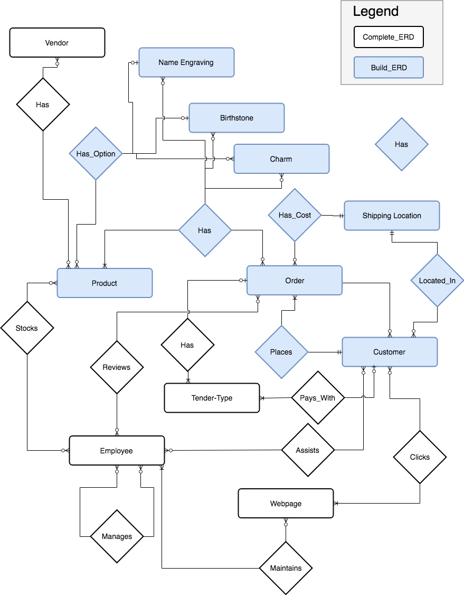

# Database
This is the initial database specification that supports our web page. This directory contains the SQL statements required to initialize the database server on `localhost` so that the Java application can access and update it. This document describes the high-level structure of the database and how to configure the MySQL instance to play nice with the Java application.

## Architecture
The auto-generated html data dictionary can be found here: [Data Dictionary](http://htmlpreview.github.io/?https://github.com/KendraMBach/CIS556_Project/readmes/database/Data_Dictionary.html)

#### High-Level ERD

## Dependencies
While it is possible to run all commands to build and configure the database from the command line, we suggest using the open source GUI DBMS software [MySQL Workbench](https://dev.mysql.com/downloads/workbench/). The MySQL database requires the following:

1. [MySQL](https://dev.mysql.com/downloads/mysql/)
1. [MySQL Workbench](https://dev.mysql.com/downloads/workbench/)

## Getting Started
This section documents how to initialize the database on a local machine, including the synthetic testing data using a single command. It is possible to build structure only, and load data at a later time using files in the sub-directories. We describe only how to run the 'all-in-one' command, as this is likely the starting place for developers.

After installation, follow these steps to configure the MySQL instance and the Java application:

1. Start the MySQL Server.
1. Open MySQL WorkBench
1. Select the 'local Instance 3306'.
1. From 'File' select 'Run SQL Script...'
1. Navigate to [all_in_one_create_jewlz.sql](all_in_one_create_jewlz.sql)
1. Refresh

Alternatively,
1. Start MySQL Server.
1. From a terminal window run: `mysql -u root -p < ~/database/all_in_one_create_jewlz.sql`

## Notes
1. It is critical that the local configuration of the database matches the hibernate specification found here: [ds-hibernate-cfg.properties](SpringMVCAnnotationOnlineStore/src/main/resources/ds-hibernate-cfg.properties).
